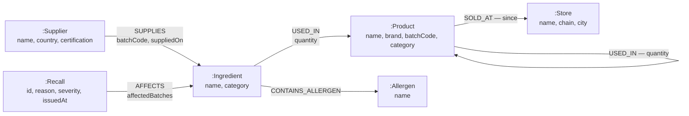
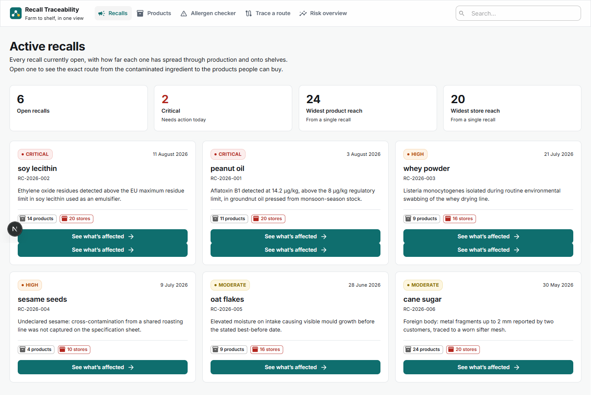
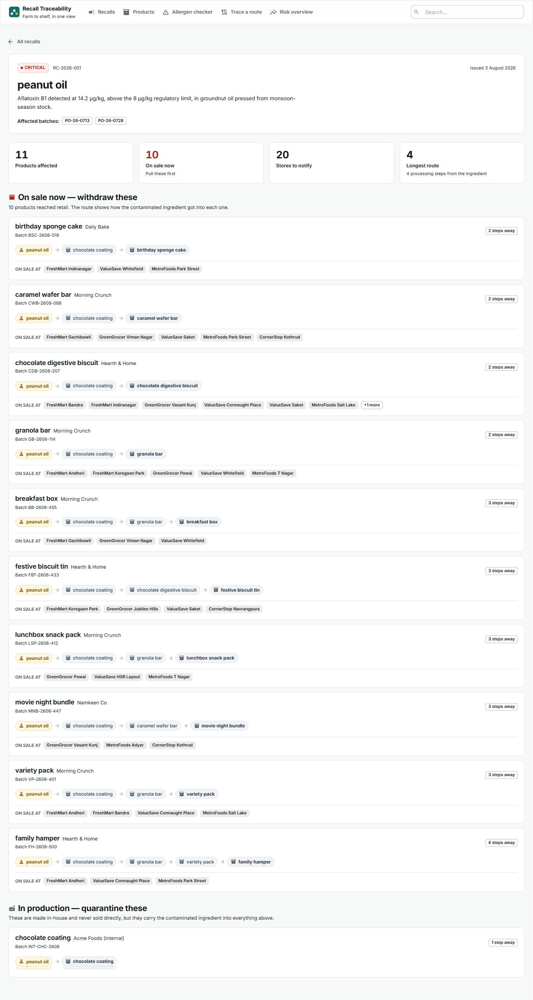
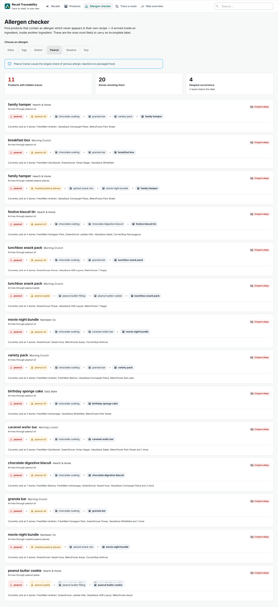
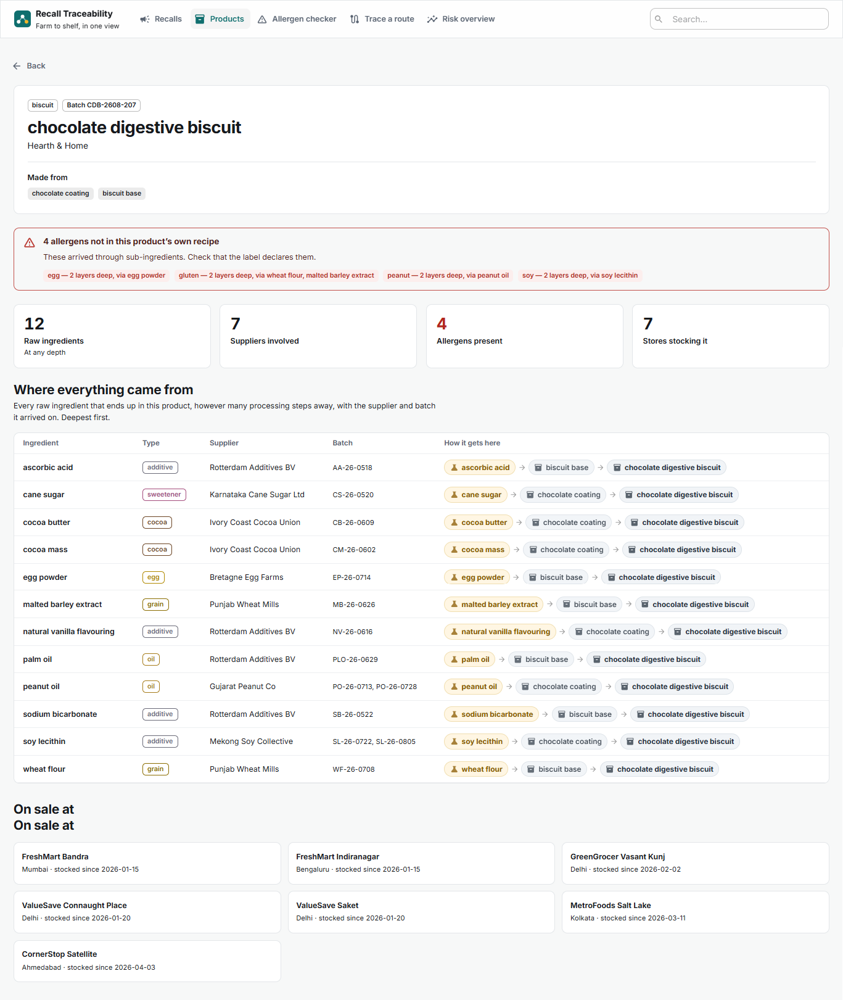

# Food Recall Traceability Explorer

Trace a contaminated ingredient through every product and shop it reached — and find
allergens hidden layers deep in a recipe.

Built on **CognoDB** (Bolt / Cypher) with **Next.js 16**, **TypeScript** and **MUI**.

**Live demo:** https://food-recall-traceability.vercel.app

---

## 1. The problem

A supplier finds contamination in a batch of peanut oil. That oil went into a chocolate
coating. The coating went onto granola bars. The bars went into variety packs, the packs
into hampers, and the hampers are on shelves in 20 shops.

Food safety law only requires **"one up, one down"** traceability — every company knows
who they bought from and who they sold to. Nobody can see the whole chain, so tracing a
contamination takes days of phone calls while the product is still on sale.

This app answers it in one query:

```
peanut oil → chocolate coating → granola bar → variety pack → family hamper → FreshMart Andheri
```

The second feature matters just as often. A chocolate digestive biscuit's recipe is
"biscuit base + chocolate coating" — nothing mentions peanuts. But peanut oil is inside
the coating, so the biscuit carries peanut traces that nobody wrote on the label.
**Undeclared allergens are among the leading causes of food recalls.** The app finds them
automatically.

**Who uses it:** the manufacturer's quality team — they're the only ones with the recipe
data. Shops receive the output; consumers get a public notice.

---

## 2. Why a graph database?

**Chains are of unknown length.** Ingredient → intermediate → product → multipack →
hamper → shop. In SQL you must know the number of joins in advance, so this needs a
recursive CTE. In Cypher it is `-[:USED_IN*1..6]->`.

**The path is the answer, not the endpoint.** "This shop is affected" is useless to a
recall officer. "Peanut Co → peanut oil → chocolate coating → granola bar → FreshMart"
tells them exactly what to pull. Relational queries return rows; graph queries return
paths.

**One set of edges answers both directions.** Forwards: "what did this supplier's batch
end up in?" Backwards: "where did everything in this product come from?" The recall screen
and the product screen run the same relationships in opposite directions.

**Shortest path is built in.** `shortestPath()` is a function call. In SQL it is a
breadth-first search you write and maintain in application code.

---

## 3. Data model



### The key modelling choice

`(:Product)-[:USED_IN]->(:Product)` lets a finished product become a component of
another. Without it every chain is two hops and the headline query is trivial. With it the
data forms four tiers:

| Tier | Example |
|---|---|
| Ingredient | peanut oil, soy lecithin |
| Intermediate | chocolate coating, biscuit base |
| Finished good | granola bar, chocolate digestive biscuit |
| Multipack | variety pack → family hamper |

### A trade-off to defend

**Batch codes are properties on relationships, not `:Batch` nodes.**

A real system would model batches as nodes, because a recall usually affects specific
batches rather than an entire ingredient. This version answers *reachability* correctly
but **over-recalls** — it says "peanut oil is affected" rather than "only batches
PO-26-0713 and PO-26-0728".

That was a deliberate scope choice to keep the graph small; `:Batch` nodes plus a validity
window on every `USED_IN` edge are the first thing I'd add for production.

### Seed data

108 nodes, 229 relationships: 12 suppliers, 36 ingredients, 28 products, 20 shops,
6 recalls, 6 allergens. Products and recipes are invented but realistically shaped; recall
reasons are real categories (aflatoxin in groundnut oil, Listeria on a dairy line,
ethylene oxide in lecithin, undeclared sesame).

---

## 4. Getting started

### Prerequisites

Node 22+ (this repo was built on Node 25 — the scripts run TypeScript directly with no
build step) and a CognoDB instance.

### Create the CognoDB instance

1. Sign in to the CognoDB console and create a new database instance
2. Download the credentials file it gives you — **the password cannot be recovered later**
3. Note the connection URI, which looks like
   `bolt+s://db-xxxxxxxx.databases.cognodb.com`

`bolt+s://` is Bolt over TLS, which CognoDB Cloud requires.

### Configure and run

```bash
npm install
```

Copy the template and fill in the values from the credentials file:

```bash
cp .env.example .env.development
```

```bash
NEO4J_URI=bolt+s://<your-instance-id>.databases.cognodb.com
NEO4J_USERNAME=cognodb
NEO4J_PASSWORD=<your-password>
NEO4J_DATABASE=neo4j
```

`.env.development` is gitignored — credentials never enter the repo, and they are only
ever read on the server. Deploying sets the same four variables in the host's environment
settings.

```bash
npm run db:check   # confirm the connection and check which Cypher features work
npm run seed       # load 108 nodes and 229 relationships (safe to re-run)
npm run verify     # run all queries against the database and assert the answers
npm run dev        # http://localhost:3000
```

### All scripts

| Command | What it does |
|---|---|
| `npm run dev` | Start the app |
| `npm run db:check` | Connection test + Cypher feature probe |
| `npm run seed` | Load the graph. Idempotent — uses `MERGE` |
| `npm run seed -- --fresh` | Wipe this app's labels first, then reload |
| `npm run verify` | 40 assertions covering every read query |
| `npm run verify:write` | 14 assertions covering product creation |
| `npm run verify:schema` | Validation rules (no database needed) |
| `npm run cypher "<query>"` | Run ad-hoc Cypher from the terminal |

---

## 5. The main queries

All six live in `src/lib/queries.ts`. Every value is a `$parameter` — there is no string
concatenation into a query anywhere, which makes injection structurally impossible and
lets the server reuse compiled query plans.

Depth is always bounded (`*1..6`). A supply chain can contain a cycle, and six hops is
past the deepest real chain in this data, so the bound costs nothing and caps the damage a
bad query can do.

### 5.1 Recall impact — the multi-hop query

> "This recall affects peanut oil. What is on shelves because of it, and how did it get
> there?"

```cypher
MATCH (r:Recall {id: $recallId})-[a:AFFECTS]->(ing:Ingredient)
MATCH path = (ing)-[:USED_IN*1..6]->(p:Product)
WITH r, a, ing, p, path, length(path) AS hops
ORDER BY hops ASC
WITH r, a, ing, p,
     min(hops)                                  AS hops,
     head(collect([n IN nodes(path) | n.name])) AS chain
OPTIONAL MATCH (p)-[:SOLD_AT]->(s:Store)
RETURN ing.name AS ingredient, p.name AS product, hops, chain,
       collect(DISTINCT s.name) AS stores
ORDER BY hops ASC
```

There are usually **many** routes from an ingredient to a product — `family hamper` is
reachable from `peanut oil` five different ways. Sorting by length and taking
`head(collect(...))` keeps one row per product carrying the **shortest** chain, which is
the most direct explanation of how the contamination arrived.

The shop is an `OPTIONAL MATCH` so affected **intermediates** still appear. Chocolate
coating is never sold to anyone, but it has to be quarantined — the UI uses the presence
of a `SOLD_AT` edge to split "withdraw from shelves" from "quarantine in production".

### 5.2 Hidden allergens — the query SQL finds awkward

> "Which products contain peanuts **without** peanuts appearing in their own recipe?"

```cypher
MATCH (a:Allergen {name: $allergen})
OPTIONAL MATCH (a)<-[:CONTAINS_ALLERGEN]-(:Ingredient)-[:USED_IN]->(direct:Product)
WITH a, collect(DISTINCT direct.name) AS declaredIn

MATCH (a)<-[:CONTAINS_ALLERGEN]-(ing:Ingredient)
MATCH path = (ing)-[:USED_IN*2..6]->(p:Product)
WHERE NOT p.name IN declaredIn
...
```

`*2..6` is the whole idea: at depth 1 the allergen is in the product's own recipe, which
is not surprising. The `declaredIn` exclusion removes products that declare the allergen
some other way — a peanut butter cookie is not interesting; a chocolate digestive biscuit
is.

### 5.3 Supplier concentration risk

> "If one supplier failed tomorrow, how much of what we sell is affected?"

```cypher
MATCH (sup:Supplier)-[:SUPPLIES]->(ing:Ingredient)
OPTIONAL MATCH (ing)-[:USED_IN*1..6]->(p:Product)
OPTIONAL MATCH (p)-[:SOLD_AT]->(st:Store)
RETURN sup.name AS supplier, sup.country AS country,
       count(DISTINCT ing) AS ingredientCount,
       count(DISTINCT p)   AS productsAffected,
       count(DISTINCT st)  AS storesAffected
ORDER BY storesAffected DESC, productsAffected DESC
```

Written as one traversal with two `OPTIONAL MATCH` steps rather than separate `MATCH`
clauses. Two `MATCH` clauses over the same suppliers produce a cartesian product before
aggregation and inflate the counts.

**The other three:** supplier reach (4.2), shortest path from supplier to shop (4.4), and
widest-reaching ingredients (4.6).

### Writing to the graph

Creating a product writes a node plus its ingredient, component and shop relationships —
**all in one transaction**, so a failure part-way rolls back rather than leaving a
half-built product.

`MERGE`, not `CREATE`. `CREATE` always makes a new node; `MERGE` is match-or-create. That
is what makes `npm run seed` safe to re-run — the second run finds everything and changes
nothing. Note the shape `MERGE (n {name: ...}) SET n.rest = ...`: merge on the identity
key only, then set the rest, or a changed description would create a duplicate.

Two guards matter more than the writes themselves:

- **Existence is checked before linking.** `MATCH (i:Ingredient {name: $name})` on a name
  that does not exist matches nothing and the `MERGE` is skipped **silently** — you would
  get a saved product with a missing ingredient and no error. Unknown names are rejected
  with a 400 naming them.
- **Deleting refuses rather than cascades.** `DETACH DELETE` removes a node together with
  its relationships (a plain `DELETE` errors while any remain), but a product that other
  products are built from returns `409` listing them. Cascading would silently break their
  chains — and in a recall system, a chain that quietly disappears is the worst failure
  mode there is.

---

## 6. CognoDB is not Neo4j

CognoDB speaks Bolt and Cypher, but it differs from Neo4j in ways that produce **silently
wrong answers rather than errors**. Each of these was found by probing with
`npm run db:check` and `npm run cypher` before any of it reached the UI.

| Behaviour | Effect | Workaround |
|---|---|---|
| A fixed segment **before** a variable-length one is dropped from the bound path | `MATCH path = (s:Supplier)-[:SUPPLIES]->(i)-[:USED_IN*1..1]->(p)` returns a 1-hop path starting at `i` — the supplier vanishes | Bind `path` to a single-segment `MATCH`, stitch the rest on in the `RETURN` |
| Pattern predicates in `WHERE` always evaluate **false** | `WHERE (a)<-[:CONTAINS_ALLERGEN]-()-[:USED_IN]->(p)` matched 0 rows when the truth was 3; negated, it matched **all 28** | Collect the exclusion set into a list, filter with `NOT ... IN` |
| `list + scalar` coerces to a string instead of appending | Chains rendered as `"[a b c]d"` | Always `list + [scalar]` |
| `EXISTS { ... }` subqueries | Syntax error | Restructure with `OPTIONAL MATCH` + `collect` |
| Parallel relationships duplicate rows | Two supplier batches produce two identical shortest paths | `DISTINCT`, or aggregate |

The second row is the dangerous one — both the positive and negated forms return
plausible-looking results. Without checking, the allergen screen would have confidently
listed every product in the database.

**Verified working:** variable-length paths, `shortestPath()`, `OPTIONAL MATCH`,
`ORDER BY` inside `WITH`, `head()`/`collect()`, map literals, `CASE`, `coalesce()`, label
predicates in `WHERE`, `MERGE`, unique constraints, indexes, explicit transactions.

---

## 7. Screens

| Screen | What it shows |
|---|---|
| **Recalls** (home) | Open recalls as cards with severity badges and how far each has spread |
| **Impact** | Affected products with the full chain, split into "withdraw from shelves" and "quarantine in production" |
| **Products** | Everything made in-house. Add a product — or an ingredient inline — and it becomes traceable immediately. Deleting is refused while other products are built from it |
| **Product detail** | Every raw ingredient at any depth with supplier and batch, plus an allergen warning |
| **Allergen checker** | Products carrying an allergen that never appears in their own recipe |
| **Trace a route** | Shortest path from any supplier to any shop |
| **Risk overview** | Supplier concentration and widest-reaching ingredients |

### Screenshots

**Recall dashboard** — every open recall, ordered by severity, with how far each has spread.



**Recall impact** — the aflatoxin recall on peanut oil. Products on sale are separated from
in-house intermediates, and each row shows the route the contamination took. The deepest
runs `peanut oil → chocolate coating → granola bar → variety pack → family hamper`.



**Allergen checker** — products carrying peanut traces that never appear in their own
recipe. `chocolate digestive biscuit` is the case that matters: its recipe is "biscuit base
+ chocolate coating", and the peanut oil is inside the coating.



**Product detail** — every raw ingredient at any depth with its supplier and batch, and a
warning for the four allergens that are not in the product's own recipe.



---

## 8. How the code is organised

```
src/
  app/
    api/                 route handlers — the only place that touches the database
    page.tsx             recall dashboard
    recalls/[id]/        impact view
    products/            list + detail
    allergens/           allergen checker
    trace/               shortest path
    risk/                risk overview
  actions/               one hook module per domain (TanStack Query)
  components/            shared UI — ChainTrail, SeverityChip, States, dialogs
  lib/
    db.ts                driver singleton, type conversion, transactions
    queries.ts           every Cypher query
    api-client.ts        axios instance + typed error normalisation
    api-response.ts      error classification for route handlers
  schemas/               Zod schemas — shared by the form and the API
  types/                 every shape, one file per entity
scripts/                 seed, verification and an ad-hoc Cypher runner
```

**Data flow:** screen → hook in `actions/` → `/api/*` route → `lib/queries.ts` → CognoDB.
Credentials only ever exist on the server; the browser talks to `/api/*` and nothing else.

### Notable decisions

**One driver instance.** A `Driver` is a connection pool, not a connection. One per
request would open a new TLS handshake every time and exhaust the free tier's connection
limit. It's stored on `globalThis` so Next's hot reload doesn't leak a pool per save.

**Errors are classified, not just thrown.** `api-response.ts` separates "the database is
unreachable" (503, offer a retry) from "that record doesn't exist" (404, show an empty
state), because the user's next action differs. Connection details are logged on the
server and never sent to the browser.

**One hook per domain.** `useProducts()` returns the list, its states, and the operations
that change it — `{ products, isLoading, error, refetch, createProduct, deleteProduct }`.
The mutation objects are returned whole rather than flattened, so the call site reads
`deleteProduct.isPending` with no invented names to keep in sync. Mutations are inert
until called, so a component that only reads the list pays nothing for them being there.

**Writing invalidates more than you'd expect.** A product sits in the middle of the graph,
so adding or removing one can extend a recall's reach, expose a new hidden allergen and
shift the risk rankings. The mutations invalidate recalls, allergens, risk, suppliers and
search — not just the product list.

**One Zod schema for the form and the API.** `src/schemas/` is imported by both the dialog
(via react-hook-form) and the route handler, so client and server validation cannot drift
apart. The client check is for feedback; the server is the authority.

**Writes run in one transaction.** Creating a product writes a node plus its ingredient,
component and shop relationships. If a later statement fails, the whole thing rolls back
rather than leaving a half-built product.

**`MERGE`, not `CREATE`.** `CREATE` always makes a new node; `MERGE` is match-or-create.
That's what makes the seed script safe to re-run — the second run finds everything and
changes nothing. Note the pattern `MERGE (n {name: ...}) SET n.rest = ...`: merge on the
identity key only, then set the rest, or a changed description would create a duplicate.

---

## 9. Known limitations

- **It over-recalls.** Batch codes are relationship properties, so a recall flags the
  whole ingredient rather than specific batches. `:Batch` nodes are the fix.
- **No time dimension.** Recipes change; a bar made in March may differ from one made in
  June. Real traceability needs validity intervals on every `USED_IN` edge.
- **No authentication, and the write endpoints are open.** Anyone with the demo URL can
  add or delete a product. That is a deliberate choice for a demo — the graph rebuilds in
  20 seconds with `npm run seed -- --fresh` — but it is the first thing that would have to
  change for real use. An internal tool holding recipe formulations needs authentication
  and per-role access; recipes are the trade secret.
- **Products and ingredients are the only writable entities.** Suppliers, shops, recalls
  and allergens come from the seed script.
- **Deleting refuses rather than cascades.** A product that other products are built from
  cannot be removed until they are — cascading would silently break their chains.
- **The hard problem isn't the query, it's the data.** This assumes one company can see
  the whole chain. In reality it is spread across companies who treat it as confidential,
  which is why standards like GS1 EPCIS exist and are only partly adopted.

---

## 10. Tech

Next.js 16 (App Router) · TypeScript · MUI 9 · TanStack Query 5 · axios · Zod 4 ·
react-hook-form · neo4j-driver 6 · CognoDB
